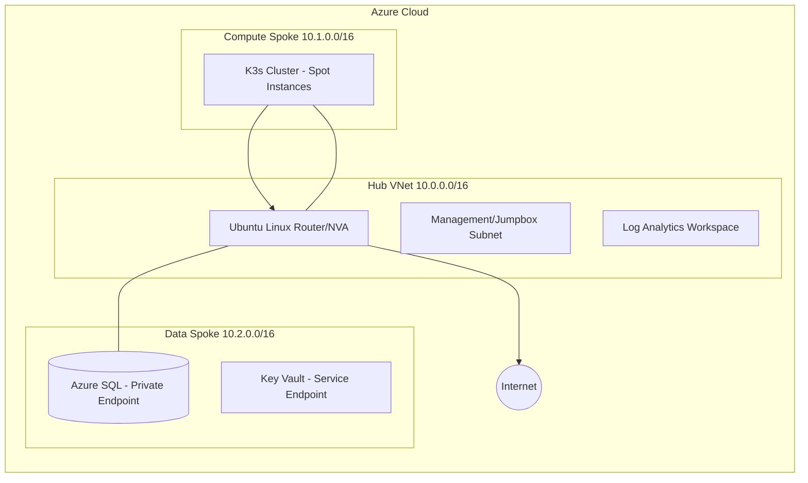

# Project Phoenix: High-Availability Trading Infrastructure

This project is a simplified version of the Empire Securites Infrastructure and trading bot. It is a secure, cost-optimized, enterprise-grade Hub-and-Spoke landing zone deployed on Azure. This environment, specifically the resources in the "spoke-compute" module are designed to be ephemeral. They will spin up, perform the neccessary calculations or trades then scale to 0.

## Network Architecture

The architecture uses a centralized Hub to govern traffic and decentralized Spokes to isolate workloads.



---

## Design Decisions and Philosophy

### 1. Networking: The Hub-and-Spoke Choice

* **Centralized Egress:** All traffic from Spokes is "Force Tunneled" through the Hub NVA via User-Defined Routes (UDRs). This allows for a single point of inspection and logging.
* **Scalable IPAM:** Using 10.x.0.0/16 increments allows for over 65,000 IPs per spoke, simplifying routing table management as the project grows.

### 2. The NVA Pivot (Cost Management)

Originally, I attempted an OPNsense NVA deployment. However, due to FreeBSD agent signaling issues in Azure, which made bootstrapping impossible, I pivoted to a hardened Ubuntu 22.04 Router.

* **Cost Savings:** Using a Standard_B1s Linux VM instead of a Standard_B2 Linux VM for OPNsnes save ~$30/month. (Obviously Azure Firewall is overkill for a portfolio project)
* **Configuration:** Implemented Kernel IP Forwarding and iptables masquerading via Cloud-init.

### 3. Security: ACLs vs. Private Link

* **Azure SQL:** Utilizes Private Endpoints ($7.50/mo) for maximum security on the data layer.
* **Key Vault:** Utilizes Service Endpoints + VNet ACLs (Free). Access is restricted at the network layer to only the Hub LAN and Compute Spoke subnets, effectively isolating secrets without the Private Link surcharge. Since these are Alpaca Paper accounts and no real capital is at stake, the Private Endpoint is unnecessary at this stage and saves $7.50/mo.

**Current Stage** Building the azure spot instances in Terraform. 

---

## Lessons Learned

### The Asymmetric Routing Trap

* **Problem:** Ping worked from Hub to Spoke, but failed from Spoke to Hub.
* **Discovery:** I forgot to create a return route in the Hub's route table. The NVA received the packet but didn't know how to send the "reply" back to the specific Spoke subnet.
* **Resolution:** Mastered the use of Azure Effective Routes tool to visualize the routing hop-by-hop.

### The Ghost Bastion Outage

* **Problem:** Bastion Developer SKU returned InternalServerError.
* **Research:** Discovered a regional service degradation in West US (2/7/26).
* **Adaptation:** I pivoted to a temporary "Just-In-Time" (JIT) whitelisted SSH access on the NVA, ensuring I could continue development while the platform stabilized.

---

## Deployment and Usage

### 1. Infrastructure (Terraform)

```bash
terraform init
terraform apply # Deploys spokes and data layers

```

### 2. Python Environment

The trading bot uses a `python:3.13-slim-bookworm` container to support the `pyodbc` drivers required for Azure SQL.

**Application Logic (main.py)** This is a simplified version of the Empire Securities trading bot, lacking about 90% of the production logic. The `main.py` script check if any of the stocks symbols in the predetermined list have three days in a row trending up. If so, it markes the stock as a "BUY". If the stock has three days in a row trending down, it is marked as a "SELL".

**Current Stage** Finished with `main.py` once epehemeral spot instances are complete will test before building trade executor script.

---

## Cost Breakdown (~$25/mo)

| Component | Cost | Optimization |
| --- | --- | --- |
| **NVA (B1s)** | ~$8/mo | Hardened Linux vs Azure FW |
| **Azure SQL** | ~$7.50/mo | Basic Tier + Private Link |
| **Log Analytics** | Pay-As-You-Go | 30-day Retention |
| **K3s Nodes** | ~$5/mo | Spot Instances (90% discount) |

---

## Roadmap for Future Improvements

* [ ] Finish refactor of Kubernetes trading bot.
* [ ] Implement GitHub Actions for "Phoenix" ephemeral deployment.
* [ ] Configure Azure Monitor and Observability Tools